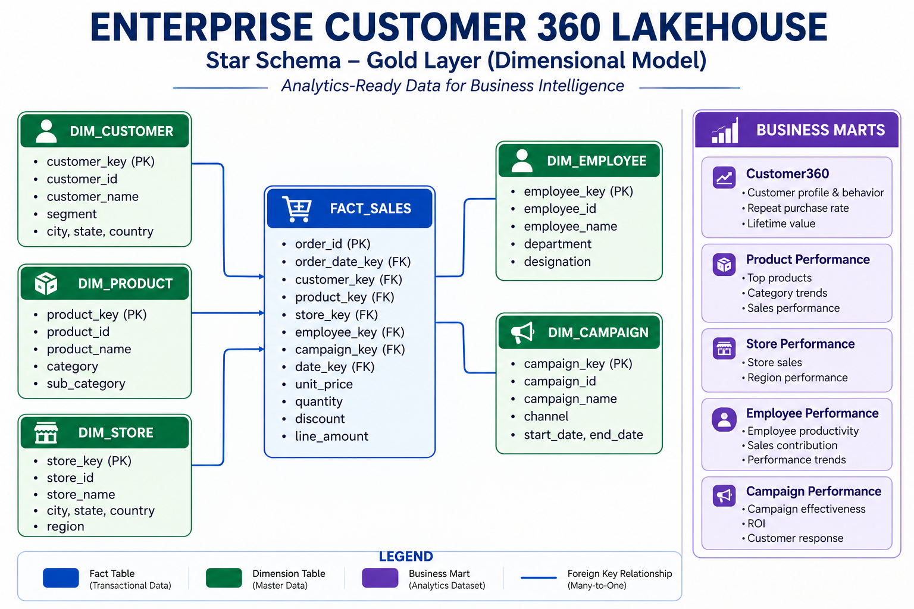

# Enterprise Customer 360 Lakehouse

### End-to-End Data Engineering Project using Databricks, Apache Spark, Delta Lake & Power BI

## Table of Contents

- [Project Overview](#project-overview)
- [Project Highlights](#project-highlights)
- [Project Metrics](#project-metrics)
- [Business Problem](#business-problem)
- [Solution Architecture](#solution-architecture)
- [Medallion Architecture](#medallion-architecture)
- [Gold Layer Star Schema](#gold-layer-star-schema)
- [Technology Stack](#technology-stack)
- [Repository Structure](#repository-structure)
- [Power BI Dashboard](#power-bi-dashboard)
- [Project Screenshots](#project-screenshots)
- [Skills Demonstrated](#skills-demonstrated)
- [Future Enhancements](#future-enhancements)
- [About the Author](#about-the-author)

## Project Overview

Enterprise Customer 360 Lakehouse is an end-to-end Data Engineering project that demonstrates how enterprise retail data can be ingested, transformed, modeled, and visualized using the Medallion Architecture.

The project follows the complete data engineering lifecycle—from raw CSV ingestion into Databricks Bronze tables, through Silver-layer cleansing and enrichment, to Gold-layer dimensional modeling and business-ready data marts. The curated data is then connected to Power BI to deliver an interactive executive dashboard for business reporting and analytics.

This project showcases practical implementation of modern Lakehouse principles, dimensional data modeling, Delta Lake, Apache Spark, and business intelligence in a single end-to-end solution.

## Project Highlights

- End-to-End Enterprise Data Engineering Pipeline
- Medallion Architecture (Bronze → Silver → Gold)
- Delta Lake Storage using Databricks
- PySpark Data Transformations
- Star Schema Data Warehouse
- Customer360 Analytics Dataset
- Business Data Marts
- Power BI Executive Dashboard
- Enterprise-Style Documentation

## Project Metrics

| Metric | Value |
|---------|------:|
| Source Files | 7 |
| Bronze Tables | 7 |
| Silver Tables | 7 |
| Gold Tables | 11 |
| Dimension Tables | 5 |
| Fact Tables | 1 |
| Business Data Marts | 5 |
| Power BI Measures | 10 |
| Dashboard Pages | 1 |

# Business Problem

Retail organizations generate data from multiple operational systems, including customer management, product catalogs, stores, employees, marketing campaigns, and sales transactions. While this data is valuable, it is often stored in raw formats that are inconsistent, duplicated, and not optimized for analytics.

Business users require a trusted, centralized, and analytics-ready dataset that supports reporting, customer insights, sales analysis, and executive decision-making.

This project demonstrates how a modern Lakehouse architecture transforms raw operational data into a scalable analytical platform using Databricks, Delta Lake, Apache Spark, and Power BI.

# Solution Architecture

The solution follows a modern Lakehouse architecture:

- Raw CSV files are ingested into the Bronze layer.
- Data is cleaned, validated, and enriched in the Silver layer.
- Analytics-ready dimensional models are created in the Gold layer.
- Gold tables are consumed by Power BI for interactive dashboards and business reporting.

# Medallion Architecture

| Layer | Purpose |
|--------|---------|
| 🥉 Bronze | Stores raw data exactly as received from source systems |
| 🥈 Silver | Cleans, validates, standardizes, and enriches datasets |
| 🥇 Gold | Creates business-ready dimension tables, fact tables, and reporting marts |

The Medallion Architecture improves data quality, simplifies downstream analytics, and separates raw operational data from curated analytical datasets.

# Gold Layer Star Schema

The Gold layer follows a dimensional model optimized for analytical workloads.

### Dimension Tables

- dim_customer
- dim_product
- dim_store
- dim_employee
- dim_campaign

### Fact Table

- fact_sales

### Business Data Marts

- customer360
- product_performance
- store_performance
- employee_performance
- campaign_performance

This dimensional model enables efficient reporting, aggregation, and dashboard development in Power BI.

# Technology Stack

| Category | Technology |
|-----------|------------|
| Platform | Databricks |
| Processing Engine | Apache Spark |
| Language | Python, PySpark |
| Storage | Delta Lake |
| Data Modeling | Star Schema |
| Architecture | Medallion Architecture |
| Analytics | Power BI |
| Version Control | Git & GitHub |

# Power BI Dashboard

The Gold layer is connected directly to Power BI through Databricks SQL Warehouse.

The dashboard provides:

- Executive KPI Cards
- Monthly Sales Trends
- Sales by Product
- Sales by Store
- Sales by Payment Method
- Order Status Analysis
- Hourly Sales Distribution
- Interactive Filters

# Project Screenshots

## Databricks Catalog

---

## Bronze Layer

---

## Silver Layer

---

## Gold Layer

---

## Power BI Semantic Model

---

## Executive Dashboard

---

## Sample PySpark Transformation

# Skills Demonstrated

- Data Engineering
- Apache Spark
- PySpark
- Delta Lake
- Databricks
- ETL Pipeline Development
- Medallion Architecture
- Star Schema Design
- Data Warehousing
- Power BI
- Data Modeling
- Business Intelligence
- Git & GitHub

# Future Enhancements

- Apache Kafka Streaming
- Apache Airflow Orchestration
- Change Data Capture (CDC)
- Incremental Data Loading
- Data Quality Framework
- Infrastructure as Code (Terraform)
- CI/CD Pipeline
- Automated Testing
- Cloud Deployment (AWS)

# About the Author

**Prithiv Nagarajan**

If you found this project interesting, feel free to connect or explore my other Data Engineering projects.

- GitHub: https://github.com/prithivnagarajan293-png
